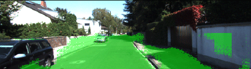
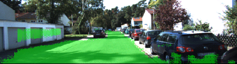
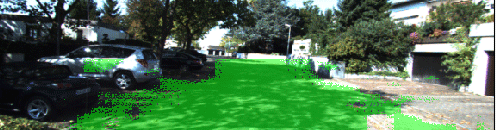
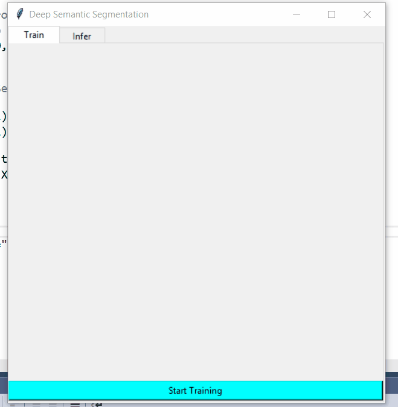

# Deep Semantic Segmentation
This is a framework for training, validation and inference of deep semantic segmentation models, but currenty it only supports FCN.
I have used it to train **Fully Convolutional Network** and detect road in a given scene using learnt model.  

`Developed using Tensorflow`

# Training Progress

#### **`Training Details`**

| Parameter    | Value         |
| ------------- | :-------------:|
**`Optimization Algorithm`**    | **`Adam`**
**`Learning Step Schedule`**    | **`Exponential Decay`**
**`Regularization`**             | **`Dropout = 0.5`**
**`Exploding Gradient Remedy`** | **`Clipping Gradient (Max Norm = 0.1)`**
**`Performance Metric`**         | **`Intersection Over Union (IOU)`**
**`Numper Of Epochs`**           | **`50`**
**`Batch Size`**                 | **`32`**

---

#### `Epoch 5 --> 10 --> 15 on validation data`

|               |		        |
| ------------- |:-------------:|
 | 
 | 
 |

#### *`Dataset`*

Download the [Kitti Road dataset](http://www.cvlibs.net/datasets/kitti/eval_road.php) from [here](http://www.cvlibs.net/download.php?file=data_road.zip).  
Extract dataset in the data folder. This will create the folder data_road with all the training and test images.


---

# Test Results
#### `After training for 50 Epochs`

#### *`IOU : 0.92`*

|       Total 160 Images        |		        
| ------------- |
|

# Usage Guide
*_It uses same class' object for training and inference depending on number of arguments used to create the object._*

Refer [train](train.py) file for training code.  
Refer [infer](infer.py) file for inference code.  
Detailed Explanation for using [FCN](ImageSemanticSegmentor/FCN/FCN.py) class is in next section

### `GUI`
#### `(Incomplete, currently being developed)`


### `Training`

---

**_Import_**

```python
from ImageSemanticSegmentor.FCN.FCN import FullyConvNet
```

**_Then set following directories_**

| Directory    | Content         |
| ------------- | :-------------:|
**`vggModelDir`**    | **`Pretrained VGG weights`**
**`trainDataDir`**    | **`Training Images`**
**`trainLabelDir`**    | **`Training Image Labels`**
**`validationDir`**    | **`Validation Images`**
**`fcnModelDir`**    | **`Saved Model Weights`**
**`fcnInferDir`**    | **`Model Weights For Inference`**
**`testDataDir`**    | **`Test Images`**
**`testResultDir`**    | **`Inference Results Of Test Images`**

**_Create Object For Training_**

```python
imageSegmenter = FullyConvNet(trainSession, vggModelDir, trainDataDir, trainLabelDir, 
                              validationDir, fcnModelDir, testDataDir, 
                              fcnInferDir, numOfClasses)
```


**_Then Set Optimization Parameters_**

| Parameter    | Purpose         | Note |
| ------------- | :-------------:|:---:|
**`optAlgo`**    | **`Optimization Algoritm`** | **`Only 3 are suppored`**
**`initLearningRate`**    | **`Step Size`**
**`ImgSize`**    | **`Image Dimension To Resize Train Images`**
**`maxGradNorm`**    | **`Maximum Gradient Norm For Clipping Gradient`** | **`Needed To Prevent Exploding Gradient`**

**_Set optimizer_**

```python
imageSegmenter.setOptimizer(optAlgo, initLearningRate, ImgSize, maxGradNorm)
```

**_Then set training parameters_**

| Parameter    | Purpose         |
| ------------- | :-------------:|
**`batchSize`**    | **`Number Of Images In Training Batch`**
**`keepProb`**    | **`Dropout Probability`**
**`metric`**    | **`Performance Metric To Use`**
**`numOfEpochs`**    | **`Number Of Times To Iterate Through Whole Train Data`**
**`saveModel`**    | **`Save Learnt Models ? `**
**`perfThresh`**    | **`Minimum Acceptable Model Performance`**
**`showSegValImages`**    | **`Display Segmented Images During Model Validation`**

**_Start training_**
```python
imageSegmenter.trainFCN(batchSize, keepProb, metric, numOfEpochs, saveModel,
                        perfThresh, showSegValImages)
```

#### *`Then Sit Back And Wait`*

---

### `Inference`
---

**_Set following parameters_**

| Parameter    | Purpose         |
| ------------- | :-------------:|
**`inferModelDir`**    | **`Directory Containing Trained Model Files`**
**`inferModelName`**    | **`Model File Name`**
**`ImgSize`**    | **`Image Dimension`**
**`numOfEpochs`**    | **`Number Of Times To Iterate Through Whole Train Data`**

**_Create object for inference_**

```python
inferSession        = tf.Session()
inferImgSegment     = FullyConvNet(inferSession, inferModelDir, inferModelName, ImgSize,
                                   numOfClasses)
```

**_Obtain segmented image_**

```python
testImage           = scipy.misc.imresize(scipy.misc.imread(image_file), ImgSize)
segmentedTestImg    = inferImgSegment.segmentThisImage(testImage)
```

---
# Future Work
* [ ] Add GUI for ~~both training and~~ inference, for user interaction.
* [ ] Develop a website to provide this as a web service.
* [ ] Extend/Modify this framework to support other semantic segmentation models.

# References
Code to generate training batches is taken from [here](https://github.com/udacity/CarND-Semantic-Segmentation/blob/master/helper.py)  
Read aboout **Fully Convolutional Network** from [here](https://arxiv.org/pdf/1605.06211.pdf)